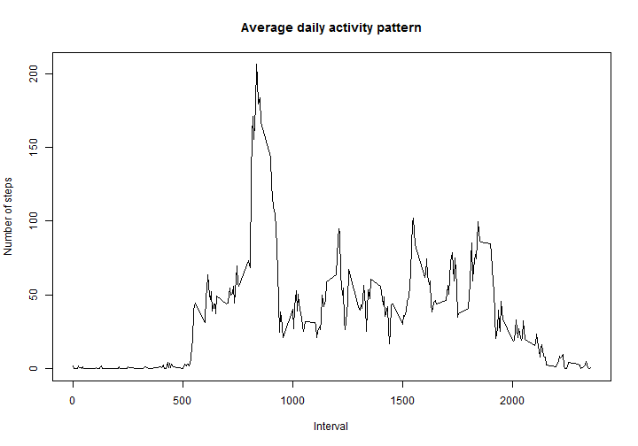
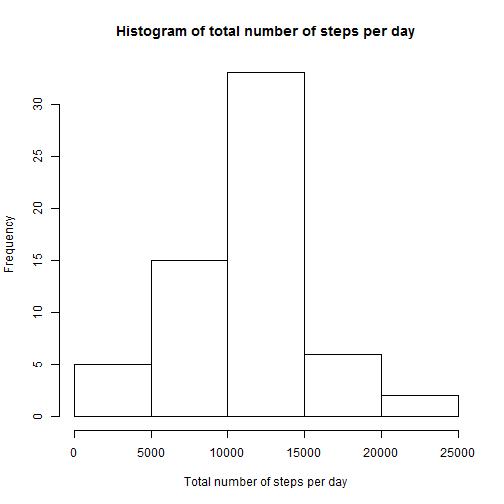
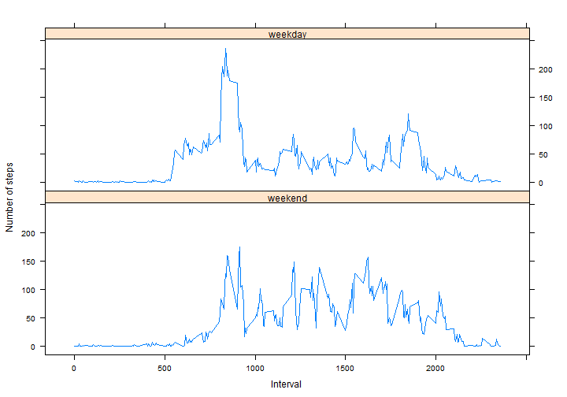

Needed libraries are loaded.


```r
library(plyr)
library(dplyr)
library(lattice)
```

## Loading and preprocessing the data

First, the original dataset is extracted from its zip package and loaded into
the R variable `act`. The reading can be done using the default settings of
`read.csv()`. The classes for each variable are then determined.


```r
unzip("activity.zip")
act <- read.csv("activity.csv")
str(act)
```

```
## 'data.frame':	17568 obs. of  3 variables:
##  $ steps   : int  NA NA NA NA NA NA NA NA NA NA ...
##  $ date    : Factor w/ 61 levels "2012-10-01","2012-10-02",..: 1 1 1 1 1 1 1 1 1 1 ...
##  $ interval: int  0 5 10 15 20 25 30 35 40 45 ...
```

It would be more proper if the dates are of the Date class so conversion is
done.


```r
act$date <- as.Date(act$date, "%Y-%m-%d")
str(act)
```

```
## 'data.frame':	17568 obs. of  3 variables:
##  $ steps   : int  NA NA NA NA NA NA NA NA NA NA ...
##  $ date    : Date, format: "2012-10-01" "2012-10-01" ...
##  $ interval: int  0 5 10 15 20 25 30 35 40 45 ...
```

Note that a whole day has 288 intervals.


```r
length(unique(act$interval))
```

```
## [1] 288
```

## What is mean total number of steps taken per day?

The assignment asks that missing values be ignored for this section. Analysis of
the data set reveals that when values go missing, they do so for 1 whole day.


```r
act.numNA <- act %>% group_by(date) %>% summarize(numNA = sum(is.na(steps)))
act.numNA[act.numNA$numNA > 0,]
```

```
## Source: local data frame [8 x 2]
## 
##         date numNA
## 1 2012-10-01   288
## 2 2012-10-08   288
## 3 2012-11-01   288
## 4 2012-11-04   288
## 5 2012-11-09   288
## 6 2012-11-10   288
## 7 2012-11-14   288
## 8 2012-11-30   288
```

Thus, we remove non-complete cases from the data set instead of using
`na.rm=TRUE` to prevent the occurrence of days with 0 total steps when the data
actually is not available.


```r
act.noNA <- act[complete.cases(act),]
```

The total number of steps per day is calculated.


```r
act.noNA.total <- act.noNA %>% group_by(date) %>% summarize(steps = sum(steps))
```

The histogram is plotted.


```r
hist(act.noNA.total$steps, main="Histogram of total number of steps per day",
     xlab="Total number of steps per day")
```

 

Finally, the mean and median of the total number of steps per day are
calculated and reported below.


```r
(act.noNA.total.est <- with(act.noNA.total,
                            c(mean = mean(steps), median = median(steps))))
```

```
##     mean   median 
## 10766.19 10765.00
```

## What is the average daily activity pattern?

Missing values are still ignored here, but now there's no good reason not to use
`na.rm=TRUE`.

For the time series plot of the average daily activity pattern, firstly the
average number of steps for each interval across all days is calculated.


```r
act.avg <- act %>% group_by(interval) %>%
                   summarize(steps = mean(steps, na.rm=TRUE))
```

Then the line plot is plotted.


```r
plot(x=act.avg$interval, y=act.avg$steps, type="l",
     main="Average daily activity pattern", xlab="Interval",
     ylab="Number of steps")
```

 

The 5-minute interval that contains the maximum number of steps on average
across all the days in the dataset is interval
835 as shown below:


```r
act.avg[which.max(act.avg$steps),]
```

```
## Source: local data frame [1 x 2]
## 
##   interval    steps
## 1      835 206.1698
```

## Imputing missing values

According to the assignment instructions, the total number of missing values is
the total number of rows with NAs, which is the total number of non-complete
cases i.e. 2304.


```r
sum(!complete.cases(act))
```

```
## [1] 2304
```

The chosen strategy for filling in missing values for a 5-minute interval is to
use the mean for that interval for that day ("day" here means day of the week
e.g Sunday, Monday rather than a specific date). This strategy doesn't have the
flaws of the alternatives stated below:

1. Mean over all intervals for that day: This will introduce spurious values
   for intervals that should not have any recorded steps e.g. when the subject
   is sleeping.
1. Mean for that interval over all days: This will ignore the difference in
   activities between weekdays and weekends.

The mean here is used instead of the median because recurrent subject activities
for a particular day may not start in the same interval each time. Thus, the
median can have a bias towards zero resulting in total steps per day that are
rather low. 

To implement this strategy, a `day` variable is added to the original dataset
and the mean by interval and day is calculated.


```r
act$day <- weekdays(act$date)
act.avg.day <- act %>% group_by(interval, day) %>%
                       summarize(steps = mean(steps, na.rm=TRUE))
```

The original dataset is then copied to a new dataset `act.imp` and its missing
values are filled in. The `join()` function is used here instead of `merge()`
because it preserves the order of `act.imp.NA` in its result.


```r
act.imp <- act
act.imp.NA <- act.imp[!complete.cases(act.imp),]
act.imp.NA.filled <- join(select(act.imp.NA, -steps), act.avg.day,
                          by=c("interval", "day"))
act.imp[!complete.cases(act.imp),]$steps <- act.imp.NA.filled$steps
```

A histogram of the total number of steps per day is plotted using the new
dataset.


```r
act.imp.total <- act.imp %>% group_by(date) %>% summarize(steps = sum(steps))
hist(act.imp.total$steps, main="Histogram of total number of steps per day",
     xlab="Total number of steps per day")
```

 

The mean and median of the total number of steps per day for the new dataset are
calculated and reported below.


```r
(act.imp.total.est <- with(act.imp.total, 
                           c(mean = mean(steps), median = median(steps))))
```

```
##     mean   median 
## 10821.21 11015.00
```

The mean and median have not changed much (by 0.5%
and 2.3% respectively), and this
histogram's shape appears to be the same as the previous histogram's shape.
Thus, this strategy for imputing missing values appears to be
distribution-preserving.

For completeness, the code for calculating the mean and median percentage
changes are as follows, with `sprintf("%.1f", x)` used to obtain 1 decimal place
for printing:


```r
c(percent.change = (act.imp.total.est["mean"] - act.noNA.total.est["mean"]) /
      act.noNA.total.est["mean"] * 100,
  percent.change = (act.imp.total.est["median"] - act.noNA.total.est["median"]) /
      act.noNA.total.est["median"] * 100)
```

```
##   percent.change.mean percent.change.median 
##             0.5110529             2.3223409
```

## Are there differences in activity patterns between weekdays and weekends?

A new factor variable is needed here that indicates whether a given date is on
a weekday or a weekend. As per assignment request, the dataset used is the new
dataset with filled-in missing values. Note that the previous section has
already added a `day` variable indicating the day of the week, and that variable
is used here.


```r
act.imp$day.type = as.factor(ifelse(act.imp$day %in% c("Saturday", "Sunday"),
                                    "weekend", "weekday"))
str(act.imp$day.type)
```

```
##  Factor w/ 2 levels "weekday","weekend": 1 1 1 1 1 1 1 1 1 1 ...
```

```r
head(act.imp[act.imp$interval == 0,], 7)
```

```
##          steps       date interval       day day.type
## 1     1.428571 2012-10-01        0    Monday  weekday
## 289   0.000000 2012-10-02        0   Tuesday  weekday
## 577   0.000000 2012-10-03        0 Wednesday  weekday
## 865  47.000000 2012-10-04        0  Thursday  weekday
## 1153  0.000000 2012-10-05        0    Friday  weekday
## 1441  0.000000 2012-10-06        0  Saturday  weekend
## 1729  0.000000 2012-10-07        0    Sunday  weekend
```

Below is the panel plot showing the average number of steps for each interval across all
weekdays and weekends. It does show that there is a difference in
activity patterns between weekdays and weekends.


```r
act.imp.day.type.avg <- act.imp %>% group_by(interval, day.type) %>%
                                    summarize(steps = mean(steps))
xyplot(steps ~ interval | day.type, data=act.imp.day.type.avg, type="l",
       layout=c(1, 2), ylab="Number of steps", xlab="Interval",
       index.cond=list(c(2, 1)))
```

 
